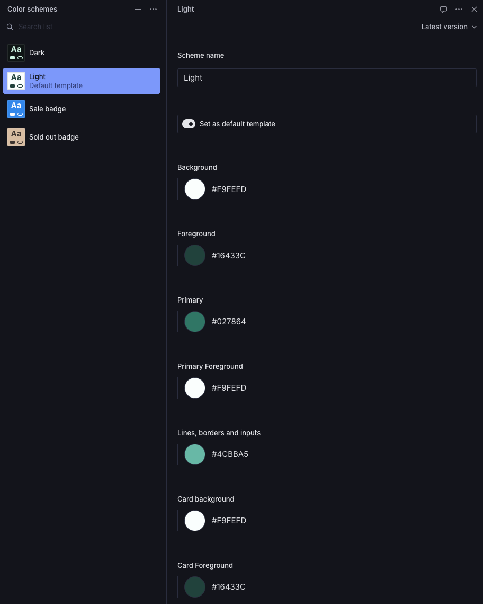

Similar to [Shopify's Liquid theme color schemes](https://help.shopify.com/en/manual/online-store/themes/theme-structure/color-scheme), you can create as many color schemes as you like.

You can choose a color scheme as your default color scheme and it will be used as the base color scheme across your theme.

You can also attach color scheme to sections, footers, header etc.

