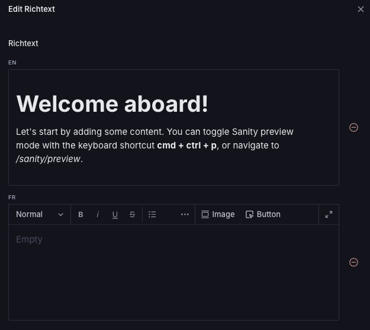
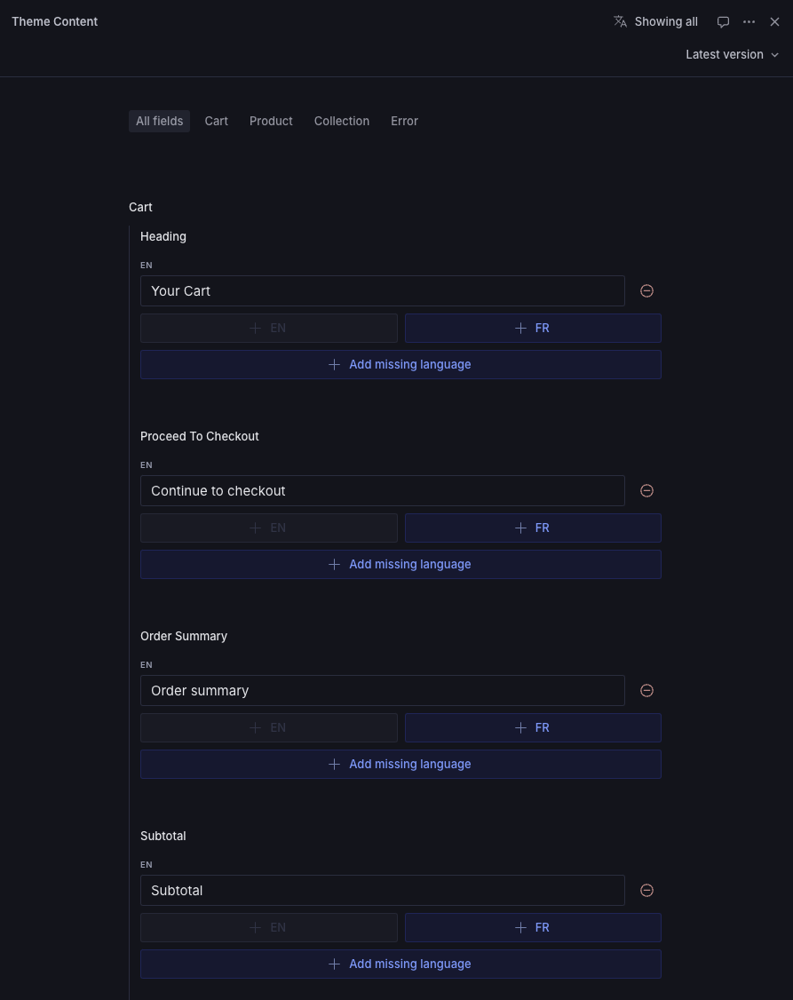

Every single content in Fluid can be localized.

You can update the `countries/index.ts` file to add or update countries and
languages.\
More info [here](/getting-started/installation#countries-and-internationalization).

You will then be able to translate every content field in the theme:\

