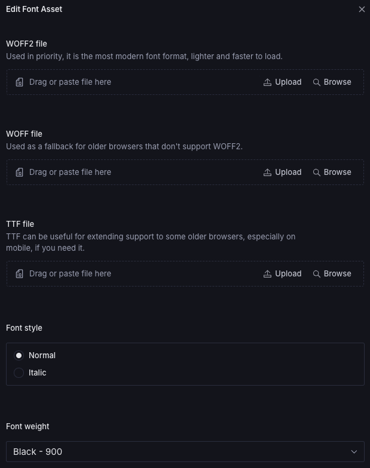

import { Steps } from "@astrojs/starlight/components";

You can add custom fonts to your theme.

<Steps>
1. Use a font library such as [Google Fonts](https://fonts.google.com/) or
[Fontshare](https://www.fontshare.com/) to download font families, styles and
variables.

2. Add the font family to Heading or Body 

3. Upload the font assets (use .woff2 files for better performance) and choose font style and font weight 

4. Update font base size, letter spacing and line height 

</Steps>
