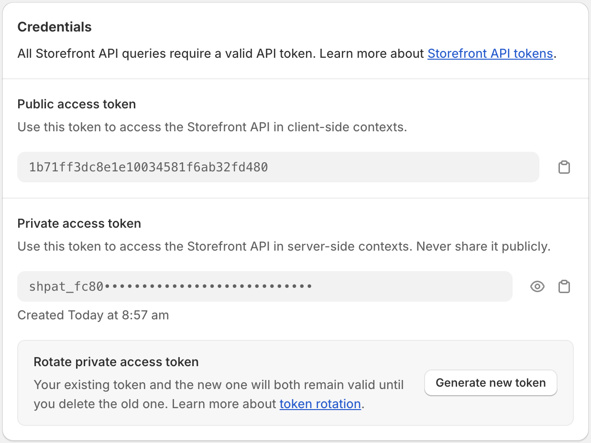

import { Code, Tabs, TabItem } from "@astrojs/starlight/components";

## Requirements

- Node.js v16.13+
- An active Shopify store
- A Sanity account (you can create an account [here](https://www.sanity.io/login/sign-up))

In addition to these requirements, we recommend understanding the basics of [React](https://react.dev/) and [Remix](https://remix.run/) to get the most out of Hydrogen.

## Step 1: Create a new Fluid project

Clone the Fluid repository using the following command in your terminal:

<Code lang="sh" code={"npx create-remix@latest --template frontvibe/fluid"} />

Move into the project directory `cd FOLDER_NAME` and create a new Sanity project running the following command:

<Code lang="sh" code={"npx sanity@latest init --env"} />

This command will generate a `.env` file in your project directory with your Sanity
project ID and dataset.

## Step 2: Install the Hydrogen or Headless channel

To use Fluid, you'll need to install the Hydrogen or Headless channel.
These Shopify channels will generate access tokens to connect Fluid to your store.

The Hydrogen channel is available for all Shopify plans (Basic, Shopify, Advanced, or Plus plan).
Development stores aren't supported at this time, but you can install the Headless channel if you want to try Fluid.

<Tabs>
  <TabItem label="Hydrogen channel">
    The Hydrogen channel is required if you plan to deploy at no cost on Oxygen,
    Shopify's global hosting solution. Once you install the [Hydrogen
    channel](https://apps.shopify.com/hydrogen) you'll need to create a new
    storefront. We invite you to follow the official [Shopify's
    instructions](https://shopify.dev/docs/custom-storefronts/hydrogen/getting-started#step-3-install-the-hydrogen-channel)
    to get started.
  </TabItem>
  <TabItem label="Headless channel">
    The headless channel can be used if you want to use an alternative hosting
    solution such as Vercel. It'll give you the same experience as the Hydrogen
    channel. You can install the [Headless
    channel](https://apps.shopify.com/headless) and create a new storefront.
  </TabItem>
</Tabs>

Once you've installed the channel, you'll need to update the `.env` file with your access tokens. You can safely duplicate the `.env.template` file and name it `.env`.

The Public access token will be your `PUBLIC_STOREFRONT_API_TOKEN` and the Private access token will be your `PRIVATE_STOREFRONT_API_TOKEN`.

You can also replace the `PUBLIC_STORE_DOMAIN` with your store's domain.

The `SESSION_SECRET` variable will be used to sign cookies. You should create a unique secret and add it to your `.env` file.

More info about signing cookies in Remix can be found [here](https://remix.run/docs/en/main/utils/cookies#signing-cookies).

The `PUBLIC_STOREFRONT_ID` can be found in the Shopify url of your storefront. If you installed the Hydrogen channel it can be found at `https://admin.shopify.com/store/STORE_NAME/custom_storefronts/YOUR_ID`.\
If you installed the Headless channel it can be found at `https://admin.shopify.com/store/STORE_NAME/headless_storefronts/YOUR_ID`.

## Sanity setup

<Code lang="sh" code={"npx sanity@latest init"} />

- Create a Sanity Account
- CORS and API credentials
- Sanity Connect (Shopify App)

## Environment variables

Replace the following values in your `.env` file.

<Code
  lang="sh"
  code={`
NODE_ENV="development"
# Shopify
SESSION_SECRET="topSecret"
PUBLIC_STORE_DOMAIN="fluid-demo.myshopify.com"
PUBLIC_STOREFRONT_API_TOKEN="046fc93a591ca78ec9dc34657b660ac6"
PRIVATE_STOREFRONT_API_TOKEN="shpat_•••••••••••••••••••••••••"
PUBLIC_STOREFRONT_ID="22227"
PUBLIC_STOREFRONT_API_VERSION="2024-01"
# Sanity
SANITY_STUDIO_PROJECT_ID="gbcm3da4"
SANITY_STUDIO_DATASET="production"
SANITY_STUDIO_API_VERSION="2023-03-20"
SANITY_STUDIO_PREVIEW_URL="https://preview-url.vercel.app"
SANITY_STUDIO_URL="http://localhost:3333"
SANITY_STUDIO_USE_STEGA="true"
SANITY_STUDIO_SHOPIFY_SHOP_HANDLE="fluid-demo"
  `}
/>

## Countries and Internationalization

Update the `countries/index.ts` file to add or update countries and languages.
The default country will be used as a fallback when no country is found in the url.

<Code
  lang="ts"
  code={`
export const countries: Localizations = {
  default: {
    country: 'US',
    currency: 'USD',
    isoCode: 'en-us',
    label: 'United States (USD $)',
    language: 'EN',
    languageLabel: 'English',
  },
  '/fr': {
    country: 'FR',
    currency: 'EUR',
    isoCode: 'fr-fr',
    label: 'France (EUR €)',
    language: 'FR',
    languageLabel: 'French',
  }
};
`}
/>
