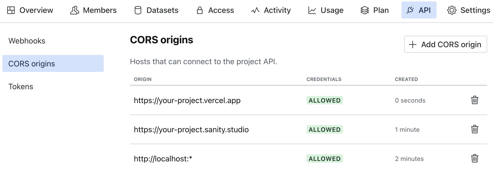
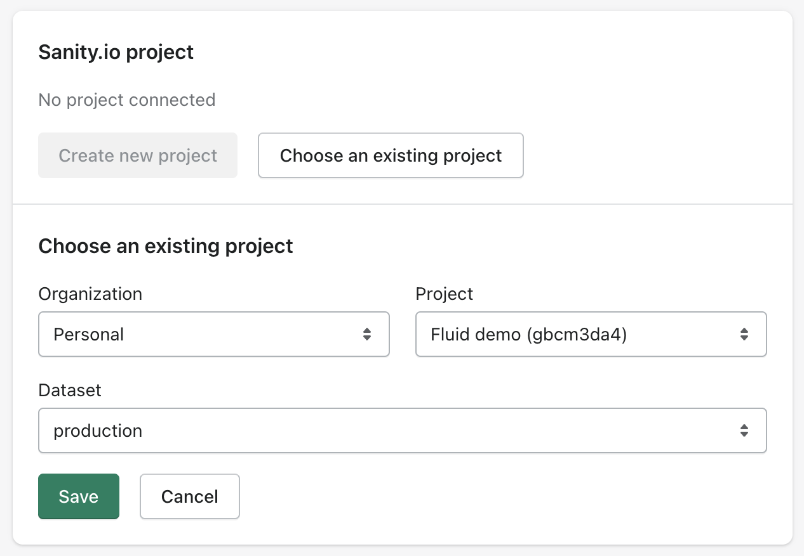
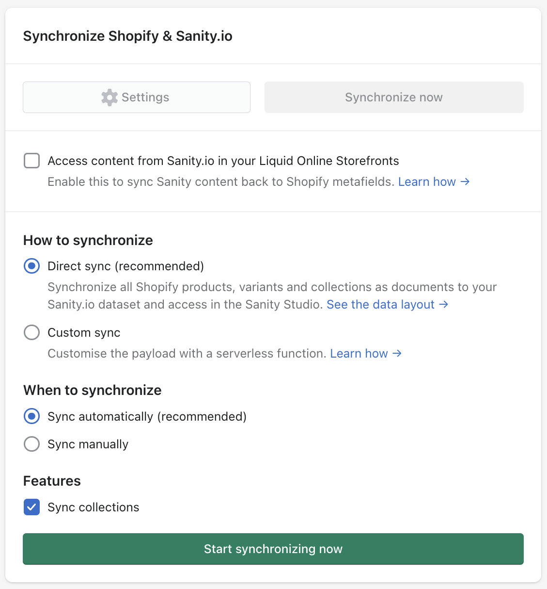
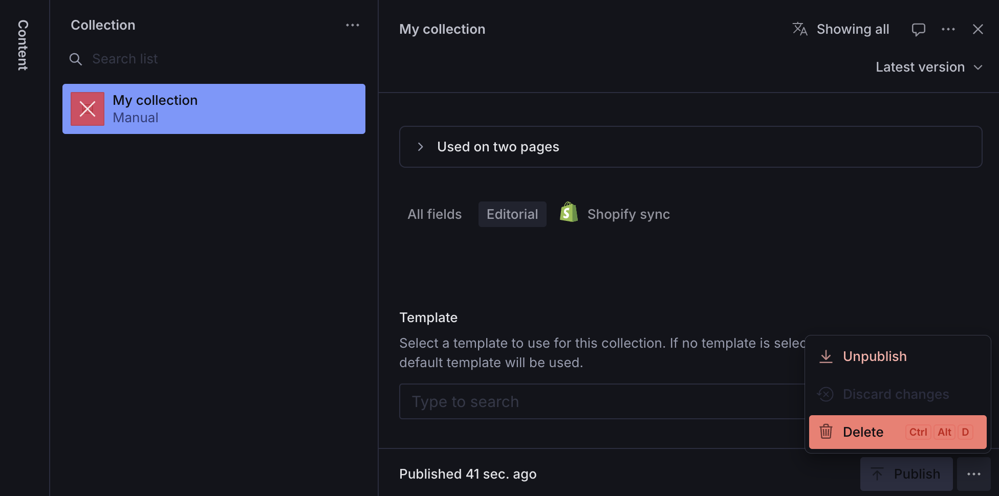

import { Code, Tabs, TabItem } from "@astrojs/starlight/components";

## Requirements

- Node.js v16.13+
- An active Shopify store
- A Sanity account (you can create one [here](https://www.sanity.io/login/sign-up))

In addition to these requirements, we recommend understanding the basics of [React](https://react.dev/) and [Remix](https://remix.run/) to get the most out of Hydrogen.

## Step 1: Create a new Fluid project

Clone the Fluid repository using the following commands in your terminal:

<Code
  lang="sh"
  code={`
mkdir my-fluid-app
cd my-fuild-app

# Clone the Fluid repository\nnpx create-remix@latest . --template frontvibe/fluid

# Create a new Sanity project\nnpx sanity@latest init --env .env.sanity

`}
/>

The `npx sanity@latest` command will create a new Sanity project and generate a `.env.sanity` file in your project directory with your `SANITY_PROJECT_ID` and `SANITY_DATASET`.
You can use these variables in your `.env` file. More details about environment variables can be found [here](#step-5-environment-variables).

## Step 2: Install the Hydrogen or Headless channel

To use Fluid, you'll need to install the Hydrogen or Headless channel.
These Shopify channels will generate access tokens to connect Fluid to your store.

The Hydrogen channel is available for all Shopify plans (Basic, Shopify, Advanced, or Plus plan).
Development stores aren't supported at this time, but you can install the Headless channel and it will work the same.

<Tabs>
  <TabItem label="Hydrogen channel">
    The Hydrogen channel is required if you plan to deploy your wesbite on
    Oxygen (Shopify's global hosting solution). Once you install the [Hydrogen
    channel](https://apps.shopify.com/hydrogen) you'll need to create a new
    storefront. We invite you to follow the official [Shopify's
    instructions](https://shopify.dev/docs/custom-storefronts/hydrogen/getting-started#step-3-install-the-hydrogen-channel)
    to get started.
  </TabItem>
  <TabItem label="Headless channel">
    The Headless channel is the right choice if you want to use an alternative
    hosting solution such as Vercel. It'll give you the exact same experience as
    the Hydrogen channel. You can install the [Headless channel
    here](https://apps.shopify.com/headless) and create a new storefront.
  </TabItem>
</Tabs>

Once you've installed the channel, you'll need to update the `.env` file with your access tokens. You can safely duplicate the `.env.template` file and name it `.env`.

The Public access token will be your `PUBLIC_STOREFRONT_API_TOKEN` and the Private access token will be your `PRIVATE_STOREFRONT_API_TOKEN`.

You can also replace the `PUBLIC_STORE_DOMAIN` with your store's domain.

## Step 3: Update Sanity CORS

Go to your Sanity admin dashboard and add every hosts that we'll need to connect to the Sanity project API.
We suggest to add `http://localhost:*` and any production domain that you want to use.
Use can use the wildcard `*` to allow multiple domains. Please note that you'll also need to add your Sanity Studio production domain.

## Step 4: Install the Sanity Connect app

To automaticcally synchronize your Shopify products and collections with your Sanity project, add the [Sanity Connect app](https://apps.shopify.com/sanity-connect) in your Shopify store.
Select the Sanity project you created and the dataset.

Leave the default settings and start synchronizing:

Now, each time you add or update a Shopify product or collection, your Sanity project will be automatically updated!

Please note that the Sanity connect app won't automatically delete products or collections that are no longer in your Shopify store.
If you you to completely delete a product or a collection from your Sanity project, you'll have to do it manually:

## Step 5: Environment variables

Fluid requires the following environment variables to function properly.
Some will be used by the Hydrogen app to connect to your Shopify store, and some will be used by the Sanity Studio.

<Code
  lang="sh"
  code={`
NODE_ENV="development"
# Shopify
SESSION_SECRET="topSecret"
PUBLIC_STORE_DOMAIN="fluid-demo.myshopify.com"
PUBLIC_STOREFRONT_API_TOKEN="046fc93a591ca78ec9dc34657b660ac6"
PRIVATE_STOREFRONT_API_TOKEN="shpat_•••••••••••••••••••••••••"
PUBLIC_STOREFRONT_ID="22227"
PUBLIC_STOREFRONT_API_VERSION="2024-01"
# Sanity
SANITY_STUDIO_PROJECT_ID="gbcm3da4"
SANITY_STUDIO_DATASET="production"
SANITY_STUDIO_API_VERSION="2023-03-20"
SANITY_STUDIO_PRODUCTION_URL="https://your-hydrogen-app.vercel.app"
SANITY_STUDIO_URL="http://localhost:3333"
SANITY_STUDIO_USE_PREVIEW_MODE="true"
SANITY_STUDIO_SHOPIFY_SHOP_HANDLE="fluid-demo"
  `}
/>

#### `SESSION_SECRET`

The `SESSION_SECRET` variable will be used to sign cookies. You should create a unique secret and add it to your `.env` file.
More info about signing cookies in Remix can be found [here](https://remix.run/docs/en/main/utils/cookies#signing-cookies).

#### `PUBLIC_STORE_DOMAIN`

The `PUBLIC_STORE_DOMAIN` variable will be used to connect to your Shopify store.

#### `PUBLIC_STOREFRONT_API_TOKEN`

The `PUBLIC_STOREFRONT_API_TOKEN` variable will be used to connect to your Shopify store.
You can find it in your Hydrogen or Headless channel.

#### `PRIVATE_STOREFRONT_API_TOKEN`

The `PRIVATE_STOREFRONT_API_TOKEN` variable will be used to connect to your Shopify store.
You can find it in your Hydrogen or Headless channel.

#### `PUBLIC_STOREFRONT_ID`

The `PUBLIC_STOREFRONT_ID` can be found in the Shopify url of your storefront. If you installed the Hydrogen channel it can be found at `https://admin.shopify.com/store/STORE_NAME/custom_storefronts/YOUR_ID`.\
If you installed the Headless channel it can be found at `https://admin.shopify.com/store/STORE_NAME/headless_storefronts/YOUR_ID`.

#### `SANITY_STUDIO_PROJECT_ID`

The `SANITY_STUDIO_PROJECT_ID` variable will be used to connect to your Sanity project.
You can find it in your Sanity project admin dashboard or in your `.env.sanity` file.

#### `SANITY_STUDIO_DATASET`

The `SANITY_STUDIO_DATASET` variable will be used to connect to your Sanity project.
You can find it in your Sanity project admin dashboard or in your `.env.sanity` file.

#### `SANITY_STUDIO_PRODUCTION_URL`

Once your app is deployed in production, your Sanity Studio will need a live url to enable live updates in preview mode.
During development, the preview url used is `http://localhost:3000`.

#### `SANITY_STUDIO_URL`

The `SANITY_STUDIO_URL` variable will be used by the Hydrogen app to enable overlays when using the preview mode.

#### `SANITY_STUDIO_USE_PREVIEW_MODE`

Used by the Hydrogen app to enable/disable Sanity Preview Mode.

Your visitors won't see these encodings, but the Overlays will see them and overlay the editing UI on hover.

More info about [Sanity Loaders and Overlays](https://www.sanity.io/docs/loaders-and-overlays).

#### `SANITY_STUDIO_SHOPIFY_SHOP_HANDLE`

Used by the Sanity Studio to build your products and collections url.
Your Shopify handle is the begining of your Shopify domain url (`HANDLE.myshopify.com`).

## Step 6: Countries and Internationalization

Update the `countries/index.ts` file to add or update countries and languages.
The default country will be used as a fallback when no country is found in the url.
This file is shared across your Hydrogen app and Sanity studio.

<Code
  lang="ts"
  code={`
export const countries: Localizations = {
  default: {
    country: 'US',
    currency: 'USD',
    isoCode: 'en-us',
    label: 'United States (USD $)',
    language: 'EN',
    languageLabel: 'English',
  },
  '/fr': {
    country: 'FR',
    currency: 'EUR',
    isoCode: 'fr-fr',
    label: 'France (EUR €)',
    language: 'FR',
    languageLabel: 'French',
  }
};
`}
/>

## Step 7: Launch your app

Before launching your app, you'll need to install the dependencies of your Hydrogen app and Sanity Studio:

<Tabs>
  <TabItem label="pnpm" icon="pnpm">
    <Code
      lang="sh"
      code={`pnpm install && cd studio && pnpm install && cd ..`}
    />
  </TabItem>
  <TabItem label="yarn" icon="seti:yarn">
    <Code
      lang="sh"
      code={`yarn install && cd studio && yarn install && cd ..`}
    />
  </TabItem>
  <TabItem label="npm" icon="seti:npm">
    <Code lang="sh" code={`npm install && cd studio && npm install && cd ..`} />
  </TabItem>
</Tabs>

To launch your app, run the following command in your terminal:

<Tabs>
  <TabItem label="pnpm" icon="pnpm">
    <Code lang="sh" code={"pnpm run dev"} />
  </TabItem>
  <TabItem label="yarn" icon="seti:yarn">
    <Code lang="sh" code={"yarn run dev"} />
  </TabItem>
  <TabItem label="npm" icon="seti:npm">
    <Code lang="sh" code={"npm run dev"} />
  </TabItem>
</Tabs>

This command will start both the Hydrogen app and the Sanity Studio in development mode.

You can use the following commands if you need to launch each apps separately:

<Tabs>
  <TabItem label="pnpm" icon="pnpm">
    <Code lang="sh" code={`pnpm run dev:app\npnpm run dev:studio`} />
  </TabItem>
  <TabItem label="yarn" icon="seti:yarn">
    <Code lang="sh" code={`yarn run dev:app\nyarn run dev:studio`} />
  </TabItem>
  <TabItem label="npm" icon="seti:npm">
    <Code lang="sh" code={`npm run dev:app\nnpm run dev:studio`} />
  </TabItem>
</Tabs>
