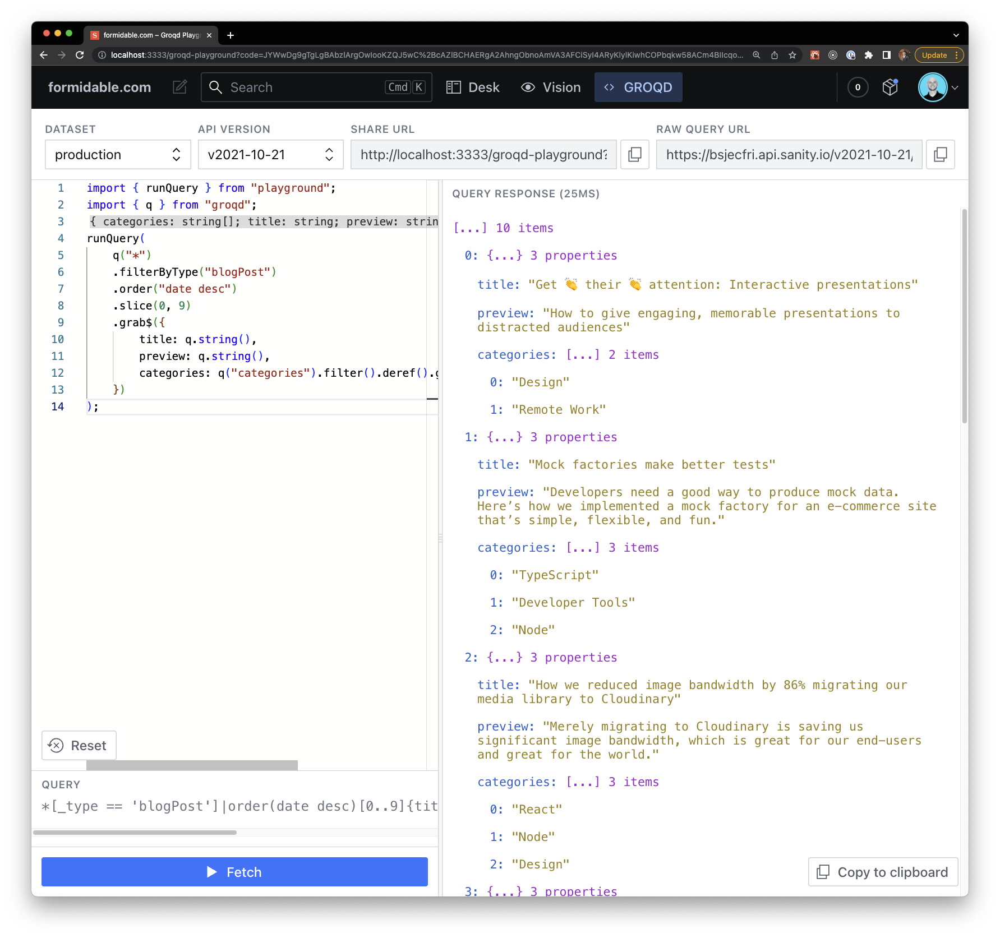

import { Code } from "@astrojs/starlight/components";

To make type safe Sanity queries, Fluid uses the [GROQD](https://commerce.nearform.com/open-source/groqd/) query builder.

GROQD is obviously more verbose than pure GROQ queries, but it makes it very convenient to get fully type safe data from Sanity.

<Code
  lang="tsx"
  code={`
// The following GROQD query
q("*[_type == 'pokemon']", { isArray: true })
  .grab({
    name: q.string(),
  })
// Translates to
[_type == 'pokemon']
`}
/>

You can learn how to build GROQD queries [here](https://commerce.nearform.com/open-source/groqd/query-building).

GROQD comes with useful [utilities](https://commerce.nearform.com/open-source/groqd/utility-types) such as `InferType` and `TypeFromSelection` to easily infer types from your queries/fragments.

In development mode, you can use the [GROQD Playground](https://commerce.nearform.com/open-source/groqd/groqd-playground) in your Studio to build queries.

